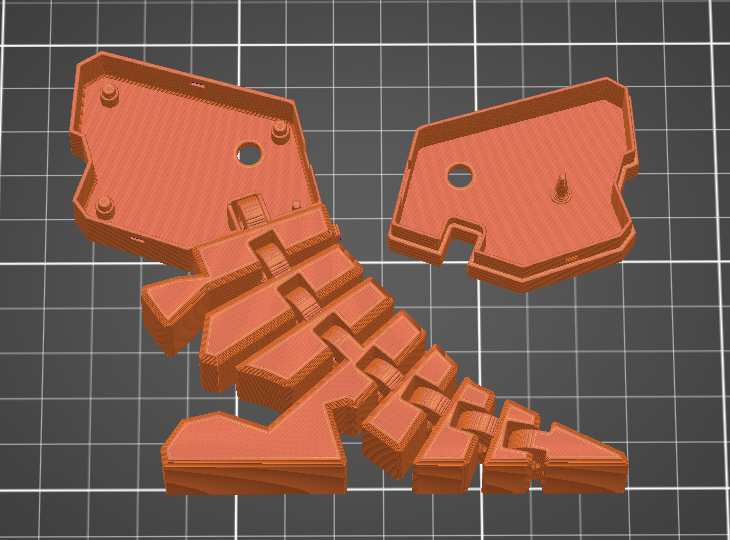

<header>
    <h1 align = "center">Flex-E-Rex-Soldering-Kit</h1>
</header>

  
   

  
   

## About
Flex E Rex is a beginer friendly soldering project developed as educational content within the Schulich School of Engineering Makermuliplex and Zetta by Lee Evans and Connor McNeill. The contents of this repo allow for anyone to assemble these kits for themselves.

For more information about equipment, trainings and classes offered within the Makermultiplex visit https://schulich.libguides.com/m2z/ or email us at m2z@ucalgary.ca. 

## How to Use
To get the kits ready for use you will need to order PCBs, 3D print the 2 enclosure parts, order the circuit components listed in the "Parts" section or found in the BOM, gather required tools and print the instructions sheet if needed.

It is recommended to briefly review the instructions before beginning assembly! The order of stems and LED spacing are important.

## Parts and Tools

### Tools:
- Soldering iron
- Lead Free Solder
- Flush cuts/Wire cutters

### Parts:
Details and links to the following components can be found in the BOM excel sheet.

| Part | Quantity |
| ----------- | ----------- |
| LED | 2 |
| Switch (PN:1825232-1) | 1 |
| Coin cell holder (PN: BK-913)|1|
|0 ohm resistor|2|
|PCB|1|
|Dino Head Top|1|
|Dino Head Bottom and Body |1|
|CR2032 coin cell battery|1|

## Fabricating PCBs

  
   

All files for fabrication are found in the folder `Flex-E Rex PCB Files 1_4x`. The fab files for different versions present as `Gerber and Drill Files_Rev#`. It is recomended to use the highest revision number as earlier versions may have problems.

Order more than you need! The highest expense when ordering these boards is shipping, so adding a few extra to the cart wont hurt.

### How We Ordered Our Boards 
- We used JLCPCB.com for fabrication, but any PCB fabricator should be able to produce these boards. 
- The boards are `1.6mm` thick.
- Base material is `FR4`.
- Surface finish is `lead free HASL`.
- Order number uses a `specified location`.
- All other settings were left as default.

## Printing Parts

  
   

Most recent STL or .3mf files are found in `Flex-E Rex CAD Files 1_4x\MK2.2.X\STL`. You will need to print both `MK2.2.0 Head+Body Assy.STL` and `MK2.2.2 Head Top.STL` for a single kit. If higher versions of the model are present, use those.

We use Prusa printers and Prusa Slicer for producing our parts, but any calibrated 3D printer and slicing software will work. Below are the settings we use. 
- PLA for material
- 0.4mm diameter nozzle
- 0.2mm layer height
- 15% infill
- No supports
- No brim/raft
   
## Versioning Explained
It is always recommended to use the highest versioned PCB and enclosure files. The below information is just to explain the versioning system used. 

**#.X.X** - Indicates assembly versions. Mostly variations in size or major design changes.

**X.#.X** - Indicates PCB versions. This can be found on the back of the PCB as a "V0.X" needs to match the enclosure parts. 

**X.X.#** - Indicates eclosure part versions. 

**Note:** Any parts with matcing #.#.X versions will be compatible.

Example: *2.2.1* is assembly version 2 with PCB version 2 and enclosure parts version 1.
